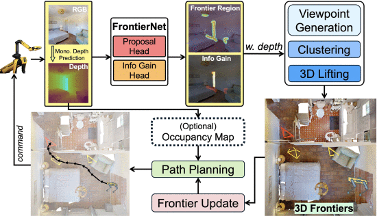

# 🤖 Academic Resources in Robotics
### Top-tier Journals & Conferences Overview

---
## 📄 Top-tier Journals & Conferences

| Abbreviation     | Cycle | Publisher | Link                                  |
|------------------|-------|-----------|---------------------------------------|
| **IJRR**         | 30d   | SAGE      | [International Journal of Robotics Research](https://journals.sagepub.com/loi/IJR) |
| **RAS**          | 30d   | Elsevier  | [Robotics and Autonomous Systems](https://www.sciencedirect.com/journal/robotics-and-autonomous-systems/issues) |
| **RA-L**         | 30d   | IEEE      | [Robotics and Automation Letters](https://ieeexplore.ieee.org/xpl/issues?punumber=7083369&isnumber=11125679) |
| **Science Robotics** | 30d | AAAS    | [Science Robotics Journal](https://www.science.org/loi/scirobotics) |
| **T-RO**         | 90d   | IEEE      | [Transactions on Robotics](https://ieeexplore.ieee.org/xpl/RecentIssue.jsp?punumber=8860) |
| **AURO**         | 90d   | Springer  | [Autonomous Robots](https://www.springer.com/journal/10514) |
| **Nature Robotics** | 90d | Nature   | [Nature Machine Intelligence](https://www.nature.com/npjrobot/articles) |

| Abbreviation | Cycle | Organization | Link                                   |
|--------------|-------|--------------|----------------------------------------|
| **ICRA**     | 365d  | IEEE         | [Int'l Conf. on Robotics and Automation](https://www.ieee-ras.org/conferences-workshops/fully-sponsored/icra) |
| **IROS**     | 365d  | IEEE & RSJ   | [Int'l Conf. on Intelligent Robots and Systems](https://www.iros.org) |
| **RSS**      | 365d  | RSS          | [Robotics: Science and Systems](https://roboticsconference.org) |
| **CoRL**     | 365d  | PMLR         | [Conference on Robot Learning](https://corlconf.github.io) |
| **ISRR**     | 730d  | IFRR         | [Int'l Symposium of Robotics Research](https://www.ifrr.org) |

---

# 🏆 Academic Impact Rankings

| Venue | Full Name | Impact | Frequency | Publisher | Link |
|-------|-----------|--------|-----------|-----------|------|
| **IJRR** | Int'l Journal of Robotics Research | 9.2 | Monthly | SAGE | [Link](https://journals.sagepub.com/loi/IJR) |
| **Science Robotics** | Science Robotics | 18.7 | Monthly | AAAS | [Link](https://www.science.org/loi/scirobotics) |
| **Nature Robotics** | Nature Machine Intelligence* | 15.5 | Quarterly | Nature | [Link](https://www.nature.com/npjrobot/articles) |
| **RA-L** | IEEE Robotics & Automation Letters | 5.2 | Monthly | IEEE | [Link](https://ieeexplore.ieee.org/xpl/issues?punumber=7083369&isnumber=11125679) |

| Venue | Full Name | Impact | Frequency | Publisher | Link |
|-------|-----------|--------|-----------|-----------|------|
| **T-RO** | IEEE Trans. on Robotics | 4.8 | Quarterly | IEEE | [Link](https://ieeexplore.ieee.org/xpl/RecentIssue.jsp?punumber=8860) |
| **RAS** | Robotics and Autonomous Systems | 3.7 | Monthly | Elsevier | [Link](https://www.sciencedirect.com/journal/robotics-and-autonomous-systems/issues) |
| **AURO** | Autonomous Robots | 3.5 | Quarterly | Springer | [Link](https://www.springer.com/journal/10514) |

| Venue | Full Name | Acceptance | Frequency | Organizer | Link |
|-------|-----------|------------|-----------|-----------|------|
| **ICRA** | IEEE Int'l Conf. on Robotics & Automation | ~40% | Annual | IEEE-RAS | [Link](https://www.ieee-ras.org/conferences-workshops/fully-sponsored/icra) |
| **IROS** | IEEE/RSJ Int'l Conf. on Intelligent Robots | ~45% | Annual | IEEE/RSJ | [Link](https://www.iros.org) |
| **RSS** | Robotics: Science and Systems | ~25% | Annual | RSS Foundation | [Link](https://roboticsconference.org) |
| **CoRL** | Conference on Robot Learning | ~30% | Annual | PMLR | [Link](https://corlconf.github.io) |

---

# 📋 Contents

| Month | Year | Status | Papers | Highlights |
|-------|------|--------|--------|------------|
| [**Academic Impact Rankings**](#🏆-academic-impact-rankings) | - | 📊 Reference | Top venues | Complete resource guide |
| [**July**](#📄-july-2025-paper-review) | 2025 | ✅ Available | 7 papers | IJRR special collection |
| [**August**](#📄-august-2025-paper-review) | 2025 | 🔄 Coming Soon | TBD | ICRA & IROS selections |
| [**September**](#📄-september-2025-paper-review) | 2025 | 📅 Planned | TBD | CoRL & RSS highlights |

---

# 📄 July 2025 Paper Review
---

## 🔥 Featured Papers

| No. | Venue | Title | Authors | Key Contribution |
|-----|-------|-------|---------|------------------|
| 1 | **IJRR** | RflyMAD: A Dataset for Multicopter Fault Detection and Health Assessment | Le et al. | Comprehensive fault detection dataset |
| 2 | **IJRR** | FusionPortableV2: A Unified Multi-Sensor Dataset for Generalized SLAM | Wei et al. | Multi-platform SLAM dataset |
| 3 | **IJRR** | BRNE: Mixed Strategy Nash Equilibrium for Crowd Navigation | Sun et al. | Bayesian Robot Navigation Engine |
| 4 | **IJRR** | Shared Visuo-Tactile Interactive Perception for Robust Object Pose Estimation | Murali et al. | Visuo-tactile shared perception framework |
| 5 | **IJRR** | Multi-Tactile Sensor Calibration via Motion Constraints | Yu et al. | Motion constraint calibration method |
| 6 | **IJRR** | JVS-SLAM: Joint Vector-Set Distribution SLAM | Inostroza et al. | Unified frontend-backend SLAM |
| 7 | **Science Robotics** | 5G+AI Bronchoscope Robot for Remote Emergency Treatment | Liu et al. | Low-cost remote medical robotics |

---
## 📖 Paper 1: RflyMAD Dataset

**RflyMAD: A Dataset for Multicopter Fault Detection and Health Assessment**

 **IJRR** | Le et al., Beihang University

### 🎯 Problem & Solution
- **Gap**: Lack of public fault detection datasets for multicopters
- **Solution**: Comprehensive dataset bridging simulation and real flight

### 📊 Dataset Overview
- **5,629 Flight Cases**: 2,566 SIL + 2,566 HIL + 497 Real flights
- **11 Fault Types**: Motor, Propeller, Sensors, Environmental  
- **6 Flight Modes**: Hover, Waypoints, Velocity, Circling, Accel/Decel
- **3 Platforms**: X200/X450/X680 multicopters (200mm-680mm)

---

## 📈 RflyMAD Research Details

### 🔬 Data Composition & Scale

| Component | SIL | HIL | Real | Description |
|-----------|-----|-----|------|-------------|
| Motor Faults | 921 | 921 | 231 | 1-4 motors failure |
| Sensor Faults | 690 | 690 | 182 | IMU, GPS, Barometer |
| Environmental | 320 | 320 | - | Wind, Load changes |
| No Fault | 200 | 200 | 84 | Normal operations |

### 🎯 Research Contributions
- **Comprehensive Coverage**: Bridges simulation and real-world data
- **Multi-modal Data**: ULog, ROS bag, Telemetry, Ground Truth
- **Transfer Learning**: Validates sim-to-real generalization
- **Benchmark Dataset**: First public multicopter fault detection dataset

---

## 📖 Paper 2: FusionPortableV2 Dataset

**FusionPortableV2: A Unified Multi-Sensor Dataset for Generalized SLAM**

**IJRR** | Wei et al., HKUST & UCL

### 🎯 Problem & Solution
- **Gap**: SLAM algorithms lack generalization across platforms and environments
- **Solution**: Unified multi-sensor dataset spanning diverse platforms and scenarios

### 📊 Dataset Overview
- **27 Sequences**: 2.5 hours total, 38.7 km distance
- **4 Platforms**: Handheld, Legged robot, UGV, Vehicle  
- **Multi-sensors**: LiDAR, Stereo cameras, Event cameras, IMU, INS
- **12 Environments**: Campus, underground, highway, multi-layer parking

---

## 📖 Paper 3: BRNE Algorithm

**BRNE: Mixed Strategy Nash Equilibrium for Crowd Navigation**

**IJRR** | Sun et al., Northwestern Univ. & Honda Research Inst.

### 🎯 Problem & Solution
- **Pain Points**: Freezing robot (uncertainty), reciprocal dance (oscillation), real-time failure (O(N³) computation)
- **Solution**: BRNE with mixed strategy Nash equilibrium & Bayesian updates

### 🚀 Core Design
- **Game Model**: Captures human behavior uncertainty
- **Update**: Iterative Bayesian (prior: trajectory; likelihood: collision risk)
- **Theoretical Gain**: Provable global equilibrium
- **Real-time**: O(TM²N²) (5 agents: Jetson; 8 agents: laptop)

---

## 📖 Paper 3: BRNE Algorithm

**Engineering: From Theory to Deployment**

**Key Implementation & Validation**

### 🔧 Technical Details
- **Strategy Representation**: Gaussian Process (GP) sampling (M=50-100 trajectories)
  - Mean: Robot (RRT) / Human (constant velocity)
  - Kernel: Smooth constraint (e.g., RBF)
- **Weight Update**: Init (1/M) → Likelihood ($L \propto \exp(-\gamma\sum R_{ik})$) → Posterior (normalized)

### 📊 Validation Results
- **Simulation (ETH/UCY)**: ↓30-50% collision rate, ↓15-25% navigation time
- **Hardware**: Quadruped (Jetson NX) + 3-5 humans (no freezing/oscillation)
- **Human-Level**: Matches real pedestrian trajectory consistency

---

## 📖 Paper 4: Visuo-Tactile Shared Perception

**Shared Visuo-Tactile Interactive Perception for Robust Object Pose Estimation**

**IJRR** | Murali, Porr, Kaboli 

### 🎯 Problem & Solution
- **Pain Points**: 
  1. Visual-only fails on transparent/specular objects; tactile-only is sparse/local.
  2. Mono-modal shared perception can’t handle cross-modal (vision+touch) mismatch.
- **Solution**: Two-robot shared visuo-tactile framework.

### 🚀 Core Design
- **Shared Perception**: UR5 + Franka Panda (Kinect) share scene data to declutter dense clutter.
- **S-TIQF**: Stochastic Translation-Invariant Quaternion Filter (Bayesian + stochastic optimization).
- **In Situ Calibration**: Visuo-tactile hand-eye calibration with arbitrary objects (no special targets).
- **Active Reconstruction**: Joint information gain criterion for NBV/NBT → reduce redundant actions.

---

## 📖 Paper 4: Visuo-Tactile Shared Perception

**Key Implementation & Validation**

**Technical Details & Experimental Results**

### 🔧 Technical Details
- **Scene Decluttering**: Declutter graph (edges = overlap/proximity; actions = grasp/push) → auto-singulate objects via semantic/grasp affordance networks.
- **Active Reconstruction**:
  - NBV: Hemisphere sampling (Panda reach: 855mm, radius: 550mm) → camera orientation toward object centroid.
  - NBT: Bounding box face sampling → touch direction = face normal.
  - Sensor Selection: Energy cost D(at) (prefer touch for transparent objects via IoU heuristic: IoUpc/rgb < ω).
- **S-TIQF Workflow**: Decouple rotation/translation → Bayesian update (prior: trajectory; likelihood: collision risk) → global optimal pose.

### 📊 Validation Results
- **Simulation (Standard Datasets)**: Outperforms SOTA in pose accuracy for dense visual + sparse tactile point clouds.
- **Real-Robot Tests**: Opaque/transparent/specular objects in dense clutter → no pose estimation failure.
- **Calibration**: In situ method avoids laborious procedures, ensures cross-modal data alignment.
- **Efficiency**: Joint info gain reduces redundant actions → faster reconstruction vs. mono-modal active perception.

---

## 📖 Paper 5: Multi-Tactile Sensor Calibration

**Multi-Tactile Sensor Calibration via Motion Constraints with Tactile Measurements**

**IJRR** | Yu et al., SJTU

### 🎯 Problem & Solution
- **Pain Points**: Multi-finger robots lack encoder-free calibration;No overlapping regions (no shared features like cameras); high-cost encoders unavailable for low-cost/soft hands.
- **Solution**: Calibrate via rigid object’s shared motion.

### 🚀 Core Design
- **Key Constraint**: Grasped object is rigid (shared unique motion for all sensors).
- **Motion Estimation**: Each sensor (e.g., GelSlim) infers object motion via contact pt registration.
- **Calibration Target**: Homogeneous transform matrix X (rotation + translation) between sensors.
- **No Object Prior**: Works for arbitrary object shapes/sizes (no CAD/models needed).

---

## 📖 Paper 5: Multi-Tactile Sensor Calibration

**Key Implementation & Validation**

### 🔧 Technical Details
1. **Object Motion Estimation**:
   - Sensor: GelSlim (vision-based tactile sensor) → captures contact 3D point clouds.
   - Process: Perturb object slightly → improved ICP → get motion matrix M (R + T) per sensor.

2. **Calibration Workflow**:
   - For 2 sensors: M₁ (sensor1’s motion), M₂ (sensor2’s motion), X (sensor2→sensor1 pose).
   - Constraint: M₁X = XM₂ (rigid object motion consistency).
   - Solve: Collect multi-group (M₁,M₂) → overdetermined equations → least squares to get X.

3. **Extension**: 3+ sensors via pairwise calibration (e.g., X₁₂→X₂₃→X₁₃).

---

## 📖 Paper 6: JVS-SLAM

**Combining the SLAM back and front ends with a joint vector-set distribution**

**IJRR** | Inostroza, Adams

### 🎯 Problem & Solution
- **Pain Points**: Traditional SLAM splits frontend (heuristic association) & backend; frontend errors (e.g., low-light misassociation) cause convergence failure; no map cardinality/association uncertainty.
- **Solution**: JVS-SLAM – unify frontend-backend via Bayesian RFS + batch optimization.

### 🚀 Core Design
- **Joint State**: Trajectory (fixed vector) + map (RFS, random cardinality) → co-estimated.
- **RFS**: Handles ambiguous association/false alarms without heuristics.
- **Batch Integration**: Combines RFS with g2o-like solvers for global consistency.
- **No Separate Frontend**: Association/map management = part of joint Bayesian estimation.

---

## 📖 Paper 7: 5G+AI Bronchoscope Robot

**AI search, physician removal: Bronchoscopy robot bridges collaboration in foreign body aspiration**

**Science Robotics** | Liu et al., Zhejiang University

### 🎯 Problem & Solution
- **Pain Points**: Bronchial foreign body aspiration (FBA) is life-threatening, but community clinics lack skilled doctors and CT imaging; traditional bronchoscopy requires pre-op CT and on-site experts.
- **Solution**: Low-cost (<$5k) portable (<2kg) bronchoscope robot with CT-free AI search + 5G remote collaboration.

### 🚀 Core Design
- **Hardware**: 3.3mm catheter + 1mm forceps, 4 linear motors for steering/actuation, 5G Remote
- **AI System**: Policy Neural Network + Tree-like Memory Bank (TLMB) + DFS planner for full lung coverage
- **Human-AI Collaboration**: AI handles search, physician controls grasping

---

## 📖 Paper 8: Surgical Embodied Intelligence for Laparoscopic Robotics

**A vision-based paradigm enabling zero-shot sim-to-real transfer for generalized task autonomy**

**Science Robotics** | Long et al., The Chinese University of Hong Kong & Cornerstone Robotics

### 🎯 Problem & Solution
- **Pain Points**: Current surgical robots lack generalizability (task/scene-specific); no open-source infrastructure; repetitive tasks cause surgeon fatigue, and training is inefficient.
- **Solution**: Open-source SurRoL simulator + VPPV vision-based learning paradigm, enabling zero-shot sim-to-real transfer for diverse laparoscopic tasks.

### 🚀 Core Design
- **Simulator (SurRoL)**: Bullet/MPM physics engines (rigid/soft-body simulation), 3D Gaussian Splatting scene generation, dVRK/ haptic device support.
- **VPPV Paradigm**: Visual Parsing (FastSAM+IGEV) → Perceptual Regressor → Policy Learning (DDPG) → Visual Servoing. 

---

## 📖 Paper 9: SRT-H: Hierarchical Framework for Autonomous Surgery

**A language-conditioned imitation learning framework for step-level autonomous cholecystectomy**

**Science Robotics** | Ji Woong (Brian) Kim et al., ARPA-H & NIH Funded Teams

### 🎯 Problem & Solution
- **Pain Points**: lack robustness to long-horizon manipulation, and error recovery; fail at complex steps
- **Solution**: **SRT-H (Hierarchical Surgical Robot Transformer)** .

### 🚀 Core Design
- **Hierarchical Architecture**:
  - **High-Level (HL) Policy**: Uses Swin-T vision encoder + transformer decoder; inputs endoscope/wrist camera images (with 4-frame history) to generate task instructions (e.g., "clip left tube") or corrective commands (e.g., "move right arm right").
  - **Low-Level (LL) Policy**: Language-conditioned (DistilBERT embeddings) EfficientNet + transformer decoder; generates 20D hybrid-relative trajectories (translation/rotation/jaw angle)

---

## 📖 Paper 10: Gait-Adaptive IMU-Enhanced Insect-Machine SAR

**A three-phase strategy for autonomous search and rescue with terrestrial insect-machine hybrid systems**

**npj Robotics** | Phuoc Thanh Tran-Ngoc et al., Nanyang Technological University

### 🎯 Problem & Solution
- **Pain Points**: external tracking;complex terrains.
- **Solution**: **Gait-adaptive IMU-enhanced three-phase exploration strategy**.

### 🚀 Core Design
- **Insect Platform**+**Onboard Backpack**: TI CC1352 + IR camera + IMU + 120mAh LiPo battery.
- **Strategy Phase I**: Lévy Walk stochastic exploration (balances local/distant searches).
- **Strategy Phase II**: Thermal Source-Based Navigation.
- **Strategy Phase III**: HOG + Linear SVM for human detection (90% accuracy, 0.5–1.5m range).
- **IMU Localization**: Uses cockroach gait vibrations (3–9Hz) to estimate speed;.

--- 

## 📖 Paper 11: FrontierNet: Vision-Cue-Driven Autonomous Exploration

**A learning-based model for pure visual frontier proposal and information gain prediction**

**RAL** | Sun et.al, ETH

### 🎯 Problem & Solution
- **Pain Points**: Traditional exploration relies on 3D maps -> ignores RGB visual cues.
- **Solution**: **FrontierNet** – pure visual model for frontier proposal & information gain prediction.

### 🚀 Core Design
- **Frontier Definition**: Yamauchi [8], mapped as "frontier pixels" (2D projection of 3D frontier).
- **FrontierNet Architecture**: Dual-head UNet-like model; inputs RGB + monocular depth prior.
  - Head 1: Predicts frontier pixels via distance field (distance to nearest frontier).
  - Head 2: Predicts information gain (new mapped volume from the frontier).
- **System Workflow**: Visual input → 2D frontier + gain → 3D candidate viewpoints → path planning (occupancy map).

--- 

 

---

## 📖 Paper 12: Multivariate Active Learning for Agricultural Robotics

**A multi-kernel Gaussian process & adaptive sampling system for real-time multi-QoI mapping**

**RAL** | Nguyen et al., University of Sydney

### 🎯 Problem & Solution
- **Pain Points**:  existing robotic methods ignore inter-QoI correlations and travel costs.
- **Solution**: **MKGP-MVAS system** – multi-kernel Gaussian process with adaptive sampling.

### 🚀 Core Design
- **MKGP Architecture**: Task-specific kernels for each QoI; Hadamard product models spatial & inter-task correlations.
- **Adaptive Sampling**: Maximizes information gain efficiency I(x)/Λ(x,xₘ) where I(x) = mapping accuracy + correlation gain.
  - RMLE + particle swarm optimization for hyperparameters
  - BLUP prediction with mean squared error estimation  
- **System Workflow**: Multi-QoI sensing → correlation learning → cost-effective sampling location selection → real-time mapping.

---

## 📖 Paper 13: MambaSlip

**MambaSlip: A Novel Multimodal Large Language Model for Real-Time Robotic Slip Detection**

**RA-L** | Wang et al., USTB

### 🎯 Problem & Solution
- **Pain Points**: Tactile-only slip detection is limited; lacks semantic understanding of slip events.
- **Solution**: **MambaSlip** – multimodal LLM combining visual, tactile, and language cues.

### 🚀 Core Design
- **Multimodal Architecture**: Vision transformer + tactile encoder + LLM(LoRA+Mamba).
- **Slip Classification**: Detects 4 slip types (rotational, translational, rolling, complete loss).
- **System Workflow**: RGB + tactile stream → feature fusion → LLM reasoning → slip prediction & recovery action.

---

## 📖 Paper 14: Unified Planning Framework for Autonomous Driving

**Unified Planning Framework With Drivable Area Attention Extraction for Autonomous Driving in Urban Scenarios**

**RA-L** | Chen et al., BIT

### 🎯 Problem & Solution
- **Pain Points**: Urban traffic diversity challenges autonomous driving stability and generalization.
- **Solution**: **UDAAE-CILQR** – unified drivable area cross-attention extraction with hierarchical planning.

### 🚀 Core Design
- **Drivable Area Extraction**: Segmentation network identifies lane gaps as potential driving targets.
- **Cross-Attention Fusion**: BEV features + lane gap features → spatiotemporal intention reasoning.
- **System Workflow**: Visual input → area extraction → attention fusion → RL decision → CILQR trajectory optimization.

---

## 📖 Paper 15: FR-Net: Robust Quadrupedal Fall Recovery

**FR-Net: Learning Robust Quadrupedal Fall Recovery on Challenging Terrains through Mass-Contact Prediction**

**RA-L** | Lu et al., University of Hong Kong

### 🎯 Problem & Solution
- **Pain Points**: Fall recovery fails on complex terrains due to incomplete terrain perception and uncertain interactions.
- **Solution**: **FR-Net** – learning framework with Mass-Contact Predictor for recovery.

### 🚀 Core Design
- **Mass-Contact Predictor**: Estimates robot mass distribution and contact states from proprioceptive inputs.
- **Stability Reward Design**: Prevents rolling on steep terrains; penalizes horizontal contact forces.
- **System Workflow**: Proprioception → mass/contact prediction → actor-critic policy → safe recovery.

---

## 📖 Paper 16: QP-Based Inner-Loop Control for Constraint-Safe and Robust Trajectory Tracking for Aerial Robots

**Constraint-Safe Trajectory Tracking for Aerial Robots**

**RA-L 2024** | Balandi et al., TU Munich

### 🎯 Problem & Solution
- **Problem**: Aerial robots need constraint-safe trajectory tracking with real-time guarantees.
- **Solution**: **QP-Control** – quadratic programming inner-loop for constraint satisfaction.

### 🚀 Core Design
- **Constraint Formulation**: Safety-critical barriers encoded as quadratic inequality constraints.
- **Real-Time QP Solver**: Inner-loop optimization ensuring constraint satisfaction during tracking.
- **Hierarchical Structure**: Outer loop generates references; inner QP ensures constraint safety.

---

## 📖 Paper 17: Armadillo-Inspired Adaptive Locomotion

**TWLHex: A Biologically Inspired Multi-Morphology Transformable Wheel-Legged Hexapod**

**RA-L 2025** | Peng et al., Beihang University

### 🎯 Problem & Solution
- **Problem**: Single-morphology robots fail in complex terrains; transformable robots limited to lightweight apps.
- **Solution**: **TWLHex** – biologically inspired hexapod with three morphologies: leg, wheel, and spoke.

### 🚀 Core Design
- **Triple Morphology**: Leg mode for terrain adaptation, wheel mode for efficiency, spoke mode for obstacle crossing.
- **Vary-Topology Design**: 2-DOF WSLegMech + TranMech enables wheel-leg module changes.
- **Heavy-Duty Performance**: 114.61kg robot climbs 45° stairs, crosses 275mm steps, carries 20kg.

---

## 📖 Paper 18: Efficient Single-Stage Framework for Trajectory Prediction

**PMM-Net: Single-Stage Multi-Agent Trajectory Prediction With Patching-Based Embedding and Explicit Modal Modulation**

**RA-L 2025** | Liu et al., Multiple Institutions

### 🎯 Problem & Solution
- **Problem**: Multi-agent trajectory prediction suffers from semantic loss using point-level tokens; complex multi-modal frameworks are inefficient for real-time robotics.
- **Solution**: **PMM-Net** – single-stage framework with patching-based temporal extraction and modality modulation.

### 🚀 Core Design
- **Patching-Based Temporal**: MLPs capture sub-series semantic info vs point-level tokens.
- **Graph-Based Social**: Inverted attention with polar coordinates ensures t/r invariance.
- **Single-Stage Multi-Modal**: Cross-attention modality modulation replaces inefficient generative models.

---

## 📖 Paper 19: Strategic Division of Labor in Customer Service

**From Attraction to Engagement: Robot-Clerk Collaboration for Retail Success**

**RA-L 2025** | Song et al., Osaka University

### 🎯 Problem & Solution
- **Problem**: Robots attract customers but lack emotional intelligence; clerks provide trust but miss initial contact opportunities.
- **Solution**: **R-RC-C Strategy** – robots attract, clerks engage, seamless handover optimizes both strengths.

### 🚀 Core Design
- **Three-Phase Approach**: Robot attraction (R) → Robot-Clerk transition (RC) → Clerk hospitality (C).
- **Implicit Handover**: Robot subtly notifies clerk when customer touches products, avoiding explicit announcements.
- **Performance**: 2.5x more store visits, 10x product engagement, 42% enter with clerk vs 13% alone.

---

