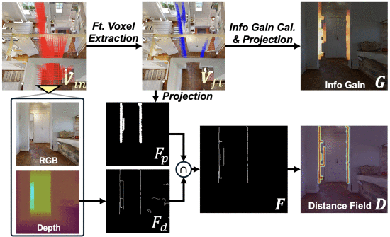

# 🤖 Academic Resources in Robotics
### Top-tier Journals & Conferences Overview

---
## 📄 Top-tier Journals & Conferences

| Abbreviation     | Cycle | Publisher | Link                                  |
|------------------|-------|-----------|---------------------------------------|
| **IJRR**         | 30d   | SAGE      | [International Journal of Robotics Research](https://journals.sagepub.com/loi/IJR) |
| **RAS**          | 30d   | Elsevier  | [Robotics and Autonomous Systems](https://www.sciencedirect.com/journal/robotics-and-autonomous-systems/issues) |
| **RA-L**         | 30d   | IEEE      | [Robotics and Automation Letters](https://ieeexplore.ieee.org/xpl/issues?punumber=7083369&isnumber=11125679) |
| **Science Robotics** | 30d | AAAS    | [Science Robotics Journal](https://www.science.org/loi/scirobotics) |
| **T-RO**         | 90d   | IEEE      | [Transactions on Robotics](https://ieeexplore.ieee.org/xpl/RecentIssue.jsp?punumber=8860) |
| **AURO**         | 90d   | Springer  | [Autonomous Robots](https://www.springer.com/journal/10514) |
| **Nature Robotics** | 90d | Nature   | [Nature Machine Intelligence](https://www.nature.com/npjrobot/articles) |

| Abbreviation | Cycle | Organization | Link                                   |
|--------------|-------|--------------|----------------------------------------|
| **ICRA**     | 365d  | IEEE         | [Int'l Conf. on Robotics and Automation](https://www.ieee-ras.org/conferences-workshops/fully-sponsored/icra) |
| **IROS**     | 365d  | IEEE & RSJ   | [Int'l Conf. on Intelligent Robots and Systems](https://www.iros.org) |
| **RSS**      | 365d  | RSS          | [Robotics: Science and Systems](https://roboticsconference.org) |
| **CoRL**     | 365d  | PMLR         | [Conference on Robot Learning](https://corlconf.github.io) |
| **ISRR**     | 730d  | IFRR         | [Int'l Symposium of Robotics Research](https://www.ifrr.org) |

---

# 🏆 Academic Impact Rankings

| Venue | Full Name | Impact | Frequency | Publisher | Link |
|-------|-----------|--------|-----------|-----------|------|
| **IJRR** | Int'l Journal of Robotics Research | 9.2 | Monthly | SAGE | [Link](https://journals.sagepub.com/loi/IJR) |
| **Science Robotics** | Science Robotics | 18.7 | Monthly | AAAS | [Link](https://www.science.org/loi/scirobotics) |
| **Nature Robotics** | Nature Machine Intelligence* | 15.5 | Quarterly | Nature | [Link](https://www.nature.com/npjrobot/articles) |
| **RA-L** | IEEE Robotics & Automation Letters | 5.2 | Monthly | IEEE | [Link](https://ieeexplore.ieee.org/xpl/issues?punumber=7083369&isnumber=11125679) |

| Venue | Full Name | Impact | Frequency | Publisher | Link |
|-------|-----------|--------|-----------|-----------|------|
| **T-RO** | IEEE Trans. on Robotics | 4.8 | Quarterly | IEEE | [Link](https://ieeexplore.ieee.org/xpl/RecentIssue.jsp?punumber=8860) |
| **RAS** | Robotics and Autonomous Systems | 3.7 | Monthly | Elsevier | [Link](https://www.sciencedirect.com/journal/robotics-and-autonomous-systems/issues) |
| **AURO** | Autonomous Robots | 3.5 | Quarterly | Springer | [Link](https://www.springer.com/journal/10514) |

| Venue | Full Name | Acceptance | Frequency | Organizer | Link |
|-------|-----------|------------|-----------|-----------|------|
| **ICRA** | IEEE Int'l Conf. on Robotics & Automation | ~40% | Annual | IEEE-RAS | [Link](https://www.ieee-ras.org/conferences-workshops/fully-sponsored/icra) |
| **IROS** | IEEE/RSJ Int'l Conf. on Intelligent Robots | ~45% | Annual | IEEE/RSJ | [Link](https://www.iros.org) |
| **RSS** | Robotics: Science and Systems | ~25% | Annual | RSS Foundation | [Link](https://roboticsconference.org) |
| **CoRL** | Conference on Robot Learning | ~30% | Annual | PMLR | [Link](https://corlconf.github.io) |

---

# 📋 Contents

| Month | Year | Status | Papers | Highlights |
|-------|------|--------|--------|------------|
| [**Academic Impact Rankings**](#🏆-academic-impact-rankings) | - | 📊 Reference | Top venues | Complete resource guide |
| [**July**](#📄-july-2025-paper-review) | 2025 | ✅ Available | 7 papers | IJRR special collection |
| [**August**](#📄-august-2025-paper-review) | 2025 | 🔄 Coming Soon | TBD | ICRA & IROS selections |
| [**September**](#📄-september-2025-paper-review) | 2025 | 📅 Planned | TBD | CoRL & RSS highlights |

---

# 📄 July 2025 Paper Review
---

<!-- Page 1 -->
| No. | Venue | Title | Authors | Key Contribution |
|-----|-------|-------|---------|------------------|
| 1 | **IJRR** | RflyMAD: A Dataset for Multicopter Fault Detection and Health Assessment | Le et al., BUAA | Comprehensive fault detection dataset |
| 2 | **IJRR** | FusionPortableV2: A Unified Multi-Sensor Dataset for Generalized SLAM | Wei et al., HKUST & UCL | Multi-platform SLAM dataset |
| 3 | **IJRR** | BRNE: Mixed Strategy Nash Equilibrium for Crowd Navigation | Sun et al., NWU & HRI | Bayesian Robot Navigation Engine |
| 4 | **IJRR** | Shared Visuo-Tactile Interactive Perception for Robust Object Pose Estimation | Murali et al., TUM | Visuo-tactile shared perception framework |
| 5 | **IJRR** | Multi-Tactile Sensor Calibration via Motion Constraints | Yu et al., SJTU | Motion constraint calibration method |
| 6 | **IJRR** | JVS-SLAM: Joint Vector-Set Distribution SLAM | Inostroza et al., UoE | Unified frontend-backend SLAM |
| 7 | **Science Robotics** | 5G+AI Bronchoscope Robot for Remote Emergency Treatment | Liu et al., ZJU | Low-cost remote medical robotics |
| 8 | **Science Robotics** | Surgical Embodied Intelligence for Laparoscopic Robotics | Long et al., CUHK & CSR | Zero-shot sim-to-real surgical autonomy |
| 9 | **Science Robotics** | SRT-H: Hierarchical Framework for Autonomous Surgery | Kim et al., NIH | Language-conditioned surgical autonomy |
| 10 | **npj Robotics** | Gait-Adaptive IMU-Enhanced Insect-Machine SAR | Tran-Ngoc et al., NTU | Insect-machine SAR with gait-adaptive IMU |
| 11 | **RAL** | FrontierNet: Vision-Cue-Driven Autonomous Exploration | Sun et al., ETH | Pure visual frontier & gain prediction |
| 12 | **RAL** | Multivariate Active Learning for Agricultural Robotics | Nguyen et al., USYD | Multi-kernel GP adaptive sampling |
| 13 | **RA-L** | MambaSlip | Wang et al., USTB | Multimodal LLM slip detection |
| 14 | **RA-L** | Unified Planning Framework for Autonomous Driving | Chen et al., BIT | Drivable area attention & planning |
| 15 | **RA-L** | FR-Net: Robust Quadrupedal Fall Recovery | Lu et al., HKU | Mass-contact prediction for recovery |

---

<!-- Page 2 -->
| No. | Venue | Title | Authors | Key Contribution |
|-----|-------|-------|---------|------------------|
| 16 | **RA-L** | QP-Based Inner-Loop Control for Aerial Robots | Balandi et al., TUM | Constraint-safe QP trajectory tracking |
| 17 | **RA-L** | Armadillo-Inspired Adaptive Locomotion | Peng et al., BUAA | Triple-morphology wheel-leg hexapod |
| 18 | **RA-L** | Efficient Single-Stage Framework for Trajectory Prediction | Liu et al., MultiInst | PMM-Net: patching-based multi-agent prediction |
| 19 | **RA-L** | Strategic Division of Labor in Customer Service | Song et al., OU | Robot-clerk collaboration in retail |
| 20 | **RA-L** | RL-Based Cooperative Persistent Coverage for Random Target Search | Li et al., BIT | MARL for multi-vehicle persistent search |
| 21 | **RA-L** | Global-State-Free Obstacle Avoidance for UAV-UGV Cooperation | Zhang et al., ZJU | CoNi-OA: model-free, global-state-free UAV avoidance |
| 22 | **RA-L** | Drive in Corridors—Safety-Enhanced End-to-End Autonomous Driving | Zhang et al., FDU | Corridor learning for safe E2E driving |
| 23 | **RA-L** | Nezha-H—A Hybrid Aerial-Underwater Observation & Sampling Robot | Song et al., WHU | H+T HAUV for 3D observation & sampling |
| 24 | **RA-L** | Learning to Escape Local Minima in Reactive Navigation | Meijer et al., ETH | Neural-augmented reactive navigation |
| 25 | **RA-L** | ArticuBEVSeg—BEV Road Semantics for Articulated LCVs | Liu et al., TJU | BEV segmentation for articulated LCVs |
| 26 | **RA-L** | Self-Supervised Cost of Transport Estimation for Multimodal Path Planning | Smith et al., MIT | Self-supervised CoT for multimodal robots |
| 27 | **RA-L** | FlightBench | Yu et al., THU | Benchmark for ego-vision quadrotor navigation |
| 28 | **RA-L** | K-BIT*: Kinematic-Constrained Batch Informed Trees | Wang et al., ZSTU | Kinematic-constrained, adaptive sampling planner |
| 29 | **RA-L** | Safety-Aware UAV Formation for UGV Guidance | Xiao et al., HUST | Unified UAV formation for UGV guidance |
| 30 | **RA-L** | Neural Predictor for Flight Control With Payload | Jin et al., NPU | Koopman-inspired force/torque prediction for UAVs |

---

| No. | Venue | Title | Authors | Key Contribution |
|-----|-------|-------|---------|------------------|
| 31 | **RA-L** | ForaNav—Insect-Inspired Navigation for MAVs in Plantations | Kuang et al., USM | HOG-based, insect-inspired MAV navigation |
| 32 | **RA-L** | Iterative Shaping of Multi-Particle Aggregates Based on Action Trees and VLM | Lee et al., PolyU | VLM/LLM symbolic planning for particle shaping |
| 33 | **RA-L** | Map Enhanced Scene Perception and Topology Reasoning | Pei et al., HKUST & NJU | SD map fusion for scene/topology reasoning |
| 34 | **RA-L** | What Matters in Learning a Zero-Shot Sim-to-Real RL Policy for Quadrotor Control? | Chen et al., THU | SimpleFlight: robust sim-to-real RL |
| 35 | **RA-L** | PromptTAD—Object-Prompt Enhanced Traffic Anomaly Detection | Qiu et al., ZJU | Object-prompted anomaly detection |
| 36 | **RA-L** | Games of Ordered Preference (GOOP) | Lee et al., UT Austin | Hierarchical preference Nash equilibrium |
| 37 | **RA-L** | Global Tensor Motion Planning (GTMP) | Le et al., TUD | Fully vectorized, batch tensor motion planning |
| 38 | **RA-L** | Overcoming Explicit Environment Representations With Geometric Fabrics | Spahn et al., TUD | Implicit SDF/FSD/raw data in Geometric Fabrics |
| 39 | **RA-L** | SIS—Seam-Informed Strategy for T-Shirt Unfolding | Huang et al., HKU & TU | Seam-based dual-arm garment unfolding |
| 40 | **RA-L** | Motion Manifold Flow Primitives (MMFP) for Task-Conditioned Trajectory Generation | Lee et al., SNU | Flow-matching on motion manifold for task-conditioned generation |
| 41 | **RA-L** | Interactive Robotic Moving Cable Segmentation by Motion Correlation | Holesovsky et al., CTU | Motion correlation for cable segmentation |
| 42 | **RA-L** | Motion Before Action (MBA): Diffusing Object Motion as Manipulation Condition | Su et al., SJTU | Two-stage diffusion for manipulation |
| 43 | **RA-L** | Learning Dexterous Manipulation from Play with Large-Scale Diffusion Models | Zhang et al., UT Austin | Play data + diffusion for dexterous hands |
| 44 | **RA-L** | Chance-Constrained Sampling-Based MPC for Collision Avoidance in Uncertain Dynamic Environments | Mohamed et al., IU | C2U-MPPI: chance-constrained MPC |
| 45 | **RA-L** | ROAR—A Robust Autonomous Aerial Tracking System for Challenging Scenarios | Zhang et al., NPU | Markov prediction & recapture for UAV tracking |

---

| No. | Venue | Title | Authors | Key Contribution |
|-----|-------|-------|---------|------------------|
| 46 | **RA-L** | Mobile Robot Navigation Using Hand-Drawn Maps: A Vision Language Model Approach | Tan et al., UofT | VLM-based navigation from hand-drawn maps |
| 47 | **RA-L** | Detection of Texting While Walking in Occluded Environment Using Variational Autoencoder for Safe Mobile Robot Navigation | Terao et al., TKU | VAE-based occlusion-robust pedestrian activity detection |

---

## 📖 Paper 1: RflyMAD Dataset

**RflyMAD: A Dataset for Multicopter Fault Detection and Health Assessment**

 **IJRR** | Le et al., BUAA

### 🎯 Problem & Solution
- **Gap**: Lack of public fault detection datasets for multicopters
- **Solution**: Comprehensive dataset bridging simulation and real flight

### 📊 Dataset Overview
- **5,629 Flight Cases**: 2,566 SIL + 2,566 HIL + 497 Real flights
- **11 Fault Types**: Motor, Propeller, Sensors, Environmental  
- **6 Flight Modes**: Hover, Waypoints, Velocity, Circling, Accel/Decel
- **3 Platforms**: X200/X450/X680 multicopters (200mm-680mm)

---

## 📈 RflyMAD Research Details

### 🔬 Data Composition & Scale

| Component | SIL | HIL | Real | Description |
|-----------|-----|-----|------|-------------|
| Motor Faults | 921 | 921 | 231 | 1-4 motors failure |
| Sensor Faults | 690 | 690 | 182 | IMU, GPS, Barometer |
| Environmental | 320 | 320 | - | Wind, Load changes |
| No Fault | 200 | 200 | 84 | Normal operations |

### 🎯 Research Contributions
- **Comprehensive Coverage**: Bridges simulation and real-world data
- **Multi-modal Data**: ULog, ROS bag, Telemetry, Ground Truth
- **Transfer Learning**: Validates sim-to-real generalization
- **Benchmark Dataset**: First public multicopter fault detection dataset

---

## 📖 Paper 2: FusionPortableV2 Dataset

**FusionPortableV2: A Unified Multi-Sensor Dataset for Generalized SLAM**

**IJRR** | Wei et al., HKUST & UCL

### 🎯 Problem & Solution
- **Gap**: SLAM algorithms lack generalization across platforms and environments
- **Solution**: Unified multi-sensor dataset spanning diverse platforms and scenarios

### 📊 Dataset Overview
- **27 Sequences**: 2.5 hours total, 38.7 km distance
- **4 Platforms**: Handheld, Legged robot, UGV, Vehicle  
- **Multi-sensors**: LiDAR, Stereo cameras, Event cameras, IMU, INS
- **12 Environments**: Campus, underground, highway, multi-layer parking

---

## 📖 Paper 3: BRNE Algorithm

**BRNE: Mixed Strategy Nash Equilibrium for Crowd Navigation**

**IJRR** | Sun et al., NWU & HRI

### 🎯 Problem & Solution
- **Pain Points**: Freezing robot (uncertainty), reciprocal dance (oscillation), real-time failure (O(N³) computation)
- **Solution**: BRNE with mixed strategy Nash equilibrium & Bayesian updates

### 🚀 Core Design
- **Game Model**: Captures human behavior uncertainty
- **Update**: Iterative Bayesian (prior: trajectory; likelihood: collision risk)
- **Theoretical Gain**: Provable global equilibrium
- **Real-time**: O(TM²N²) (5 agents: Jetson; 8 agents: laptop)

---

## 📖 Paper 3: BRNE Algorithm

**Engineering: From Theory to Deployment**

**Key Implementation & Validation**

### 🔧 Technical Details
- **Strategy Representation**: Gaussian Process (GP) sampling (M=50-100 trajectories)
  - Mean: Robot (RRT) / Human (constant velocity)
  - Kernel: Smooth constraint (e.g., RBF)
- **Weight Update**: Init (1/M) → Likelihood ($L \propto \exp(-\gamma\sum R_{ik})$) → Posterior (normalized)

### 📊 Validation Results
- **Simulation (ETH/UCY)**: ↓30-50% collision rate, ↓15-25% navigation time
- **Hardware**: Quadruped (Jetson NX) + 3-5 humans (no freezing/oscillation)
- **Human-Level**: Matches real pedestrian trajectory consistency

---

## 📖 Paper 4: Visuo-Tactile Shared Perception

**Shared Visuo-Tactile Interactive Perception for Robust Object Pose Estimation**

**IJRR** | Murali et al., TUM

### 🎯 Problem & Solution
- **Pain Points**: 
  1. Visual-only fails on transparent/specular objects; tactile-only is sparse/local.
  2. Mono-modal shared perception can’t handle cross-modal (vision+touch) mismatch.
- **Solution**: Two-robot shared visuo-tactile framework.

### 🚀 Core Design
- **Shared Perception**: UR5 + Franka Panda (Kinect) share scene data to declutter dense clutter.
- **S-TIQF**: Stochastic Translation-Invariant Quaternion Filter (Bayesian + stochastic optimization).
- **In Situ Calibration**: Visuo-tactile hand-eye calibration with arbitrary objects (no special targets).
- **Active Reconstruction**: Joint information gain criterion for NBV/NBT → reduce redundant actions.

---

## 📖 Paper 4: Visuo-Tactile Shared Perception

**Key Implementation & Validation**

**Technical Details & Experimental Results**

### 🔧 Technical Details
- **Scene Decluttering**: Declutter graph (edges = overlap/proximity; actions = grasp/push) → auto-singulate objects via semantic/grasp affordance networks.
- **Active Reconstruction**:
  - NBV: Hemisphere sampling (Panda reach: 855mm, radius: 550mm) → camera orientation toward object centroid.
  - NBT: Bounding box face sampling → touch direction = face normal.
  - Sensor Selection: Energy cost D(at) (prefer touch for transparent objects via IoU heuristic: IoUpc/rgb < ω).
- **S-TIQF Workflow**: Decouple rotation/translation → Bayesian update (prior: trajectory; likelihood: collision risk) → global optimal pose.

### 📊 Validation Results
- **Simulation (Standard Datasets)**: Outperforms SOTA in pose accuracy for dense visual + sparse tactile point clouds.
- **Real-Robot Tests**: Opaque/transparent/specular objects in dense clutter → no pose estimation failure.
- **Calibration**: In situ method avoids laborious procedures, ensures cross-modal data alignment.
- **Efficiency**: Joint info gain reduces redundant actions → faster reconstruction vs. mono-modal active perception.

---

## 📖 Paper 5: Multi-Tactile Sensor Calibration

**Multi-Tactile Sensor Calibration via Motion Constraints with Tactile Measurements**

**IJRR** | Yu et al., SJTU

### 🎯 Problem & Solution
- **Pain Points**: Multi-finger robots lack encoder-free calibration;No overlapping regions (no shared features like cameras); high-cost encoders unavailable for low-cost/soft hands.
- **Solution**: Calibrate via rigid object’s shared motion.

### 🚀 Core Design
- **Key Constraint**: Grasped object is rigid (shared unique motion for all sensors).
- **Motion Estimation**: Each sensor (e.g., GelSlim) infers object motion via contact pt registration.
- **Calibration Target**: Homogeneous transform matrix X (rotation + translation) between sensors.
- **No Object Prior**: Works for arbitrary object shapes/sizes (no CAD/models needed).

---

## 📖 Paper 5: Multi-Tactile Sensor Calibration

**Key Implementation & Validation**

### 🔧 Technical Details
1. **Object Motion Estimation**:
   - Sensor: GelSlim (vision-based tactile sensor) → captures contact 3D point clouds.
   - Process: Perturb object slightly → improved ICP → get motion matrix M (R + T) per sensor.

2. **Calibration Workflow**:
   - For 2 sensors: M₁ (sensor1’s motion), M₂ (sensor2’s motion), X (sensor2→sensor1 pose).
   - Constraint: M₁X = XM₂ (rigid object motion consistency).
   - Solve: Collect multi-group (M₁,M₂) → overdetermined equations → least squares to get X.

3. **Extension**: 3+ sensors via pairwise calibration (e.g., X₁₂→X₂₃→X₁₃).

---

## 📖 Paper 6: JVS-SLAM

**Combining the SLAM back and front ends with a joint vector-set distribution**

**IJRR** | Inostroza et al., UoE

### 🎯 Problem & Solution
- **Pain Points**: Traditional SLAM splits frontend (heuristic association) & backend; frontend errors (e.g., low-light misassociation) cause convergence failure; no map cardinality/association uncertainty.
- **Solution**: JVS-SLAM – unify frontend-backend via Bayesian RFS + batch optimization.

### 🚀 Core Design
- **Joint State**: Trajectory (fixed vector) + map (RFS, random cardinality) → co-estimated.
- **RFS**: Handles ambiguous association/false alarms without heuristics.
- **Batch Integration**: Combines RFS with g2o-like solvers for global consistency.
- **No Separate Frontend**: Association/map management = part of joint Bayesian estimation.

---

## 📖 Paper 7: 5G+AI Bronchoscope Robot

**AI search, physician removal: Bronchoscopy robot bridges collaboration in foreign body aspiration**

**Science Robotics** | Liu et al., ZJU

### 🎯 Problem & Solution
- **Pain Points**: Bronchial foreign body aspiration (FBA) is life-threatening, but community clinics lack skilled doctors and CT imaging; traditional bronchoscopy requires pre-op CT and on-site experts.
- **Solution**: Low-cost (<$5k) portable (<2kg) bronchoscope robot with CT-free AI search + 5G remote collaboration.

### 🚀 Core Design
- **Hardware**: 3.3mm catheter + 1mm forceps, 4 linear motors for steering/actuation, 5G Remote
- **AI System**: Policy Neural Network + Tree-like Memory Bank (TLMB) + DFS planner for full lung coverage
- **Human-AI Collaboration**: AI handles search, physician controls grasping

---

## 📖 Paper 8: Surgical Embodied Intelligence for Laparoscopic Robotics

**A vision-based paradigm enabling zero-shot sim-to-real transfer for generalized task autonomy**

**Science Robotics** | Long et al., CUHK & CSR

### 🎯 Problem & Solution
- **Pain Points**: Current surgical robots lack generalizability (task/scene-specific); no open-source infrastructure; repetitive tasks cause surgeon fatigue, and training is inefficient.
- **Solution**: Open-source SurRoL simulator + VPPV vision-based learning paradigm, enabling zero-shot sim-to-real transfer for diverse laparoscopic tasks.

### 🚀 Core Design
- **Simulator (SurRoL)**: Bullet/MPM physics engines (rigid/soft-body simulation), 3D Gaussian Splatting scene generation, dVRK/ haptic device support.
- **VPPV Paradigm**: Visual Parsing (FastSAM+IGEV) → Perceptual Regressor → Policy Learning (DDPG) → Visual Servoing. 

---

## 📖 Paper 9: SRT-H: Hierarchical Framework for Autonomous Surgery

**A language-conditioned imitation learning framework for step-level autonomous cholecystectomy**

**Science Robotics** | Kim et al., NIH

### 🎯 Problem & Solution
- **Pain Points**: lack robustness to long-horizon manipulation, and error recovery; fail at complex steps
- **Solution**: **SRT-H (Hierarchical Surgical Robot Transformer)** .

### 🚀 Core Design
- **Hierarchical Architecture**:
  - **High-Level (HL) Policy**: Uses Swin-T vision encoder + transformer decoder; inputs endoscope/wrist camera images (with 4-frame history) to generate task instructions (e.g., "clip left tube") or corrective commands (e.g., "move right arm right").
  - **Low-Level (LL) Policy**: Language-conditioned (DistilBERT embeddings) EfficientNet + transformer decoder; generates 20D hybrid-relative trajectories (translation/rotation/jaw angle)

---

## 📖 Paper 10: Gait-Adaptive IMU-Enhanced Insect-Machine SAR

**A three-phase strategy for autonomous search and rescue with terrestrial insect-machine hybrid systems**

**npj Robotics** | Tran-Ngoc et al., NTU

### 🎯 Problem & Solution
- **Pain Points**: external tracking;complex terrains.
- **Solution**: **Gait-adaptive IMU-enhanced three-phase exploration strategy**.

### 🚀 Core Design
- **Insect Platform**+**Onboard Backpack**: TI CC1352 + IR camera + IMU + 120mAh LiPo battery.
- **Strategy Phase I**: Lévy Walk stochastic exploration (balances local/distant searches).
- **Strategy Phase II**: Thermal Source-Based Navigation.
- **Strategy Phase III**: HOG + Linear SVM for human detection (90% accuracy, 0.5–1.5m range).
- **IMU Localization**: Uses cockroach gait vibrations (3–9Hz) to estimate speed;.

--- 

## 📖 Paper 11: FrontierNet: Vision-Cue-Driven Autonomous Exploration

**A learning-based model for pure visual frontier proposal and information gain prediction**

**RAL** | Sun et al., ETH

### 🎯 Problem & Solution
- **Pain Points**: Traditional exploration relies on 3D maps -> ignores RGB visual cues.
- **Solution**: **FrontierNet** – pure visual model for frontier proposal & information gain prediction.

### 🚀 Core Design
- **Frontier Definition**: Yamauchi [8], mapped as "frontier pixels" (2D projection of 3D frontier).
- **FrontierNet Architecture**: Dual-head UNet-like model; inputs RGB + monocular depth prior.
  - Head 1: Predicts frontier pixels via distance field (distance to nearest frontier).
  - Head 2: Predicts information gain (new mapped volume from the frontier).
- **System Workflow**: Visual input → 2D frontier + gain → 3D candidate viewpoints → path planning (occupancy map).

--- 

 

---

## 📖 Paper 12: Multivariate Active Learning for Agricultural Robotics

**A multi-kernel Gaussian process & adaptive sampling system for real-time multi-QoI mapping**

**RAL** | Nguyen et al., USYD

### 🎯 Problem & Solution
- **Pain Points**:  existing robotic methods ignore inter-QoI correlations and travel costs.
- **Solution**: **MKGP-MVAS system** – multi-kernel Gaussian process with adaptive sampling.

### 🚀 Core Design
- **MKGP Architecture**: Task-specific kernels for each QoI; Hadamard product models spatial & inter-task correlations.
- **Adaptive Sampling**: Maximizes information gain efficiency I(x)/Λ(x,xₘ) where I(x) = mapping accuracy + correlation gain.
  - RMLE + particle swarm optimization for hyperparameters
  - BLUP prediction with mean squared error estimation  
- **System Workflow**: Multi-QoI sensing → correlation learning → cost-effective sampling location selection → real-time mapping.

---

## 📖 Paper 13: MambaSlip

**MambaSlip: A Novel Multimodal Large Language Model for Real-Time Robotic Slip Detection**

**RA-L** | Wang et al., USTB

### 🎯 Problem & Solution
- **Pain Points**: Tactile-only slip detection is limited; lacks semantic understanding of slip events.
- **Solution**: **MambaSlip** – multimodal LLM combining visual, tactile, and language cues.

### 🚀 Core Design
- **Multimodal Architecture**: Vision transformer + tactile encoder + LLM(LoRA+Mamba).
- **Slip Classification**: Detects 4 slip types (rotational, translational, rolling, complete loss).
- **System Workflow**: RGB + tactile stream → feature fusion → LLM reasoning → slip prediction & recovery action.

---

## 📖 Paper 14: Unified Planning Framework for Autonomous Driving

**Unified Planning Framework With Drivable Area Attention Extraction for Autonomous Driving in Urban Scenarios**

**RA-L** | Chen et al., BIT

### 🎯 Problem & Solution
- **Pain Points**: Urban traffic diversity challenges autonomous driving stability and generalization.
- **Solution**: **UDAAE-CILQR** – unified drivable area cross-attention extraction with hierarchical planning.

### 🚀 Core Design
- **Drivable Area Extraction**: Segmentation network identifies lane gaps as potential driving targets.
- **Cross-Attention Fusion**: BEV features + lane gap features → spatiotemporal intention reasoning.
- **System Workflow**: Visual input → area extraction → attention fusion → RL decision → CILQR trajectory optimization.

---

## 📖 Paper 15: FR-Net: Robust Quadrupedal Fall Recovery

**FR-Net: Learning Robust Quadrupedal Fall Recovery on Challenging Terrains through Mass-Contact Prediction**

**RA-L** | Lu et al., HKU

### 🎯 Problem & Solution
- **Pain Points**: Fall recovery fails on complex terrains due to incomplete terrain perception and uncertain interactions.
- **Solution**: **FR-Net** – learning framework with Mass-Contact Predictor for recovery.

### 🚀 Core Design
- **Mass-Contact Predictor**: Estimates robot mass distribution and contact states from proprioceptive inputs.
- **Stability Reward Design**: Prevents rolling on steep terrains; penalizes horizontal contact forces.
- **System Workflow**: Proprioception → mass/contact prediction → actor-critic policy → safe recovery.

---

## 📖 Paper 16: QP-Based Inner-Loop Control for Constraint-Safe and Robust Trajectory Tracking for Aerial Robots

**Constraint-Safe Trajectory Tracking for Aerial Robots**

**RA-L 2024** | Balandi et al., TUM

### 🎯 Problem & Solution
- **Problem**: Aerial robots need constraint-safe trajectory tracking with real-time guarantees.
- **Solution**: **QP-Control** – quadratic programming inner-loop for constraint satisfaction.

### 🚀 Core Design
- **Constraint Formulation**: Safety-critical barriers encoded as quadratic inequality constraints.
- **Real-Time QP Solver**: Inner-loop optimization ensuring constraint satisfaction during tracking.
- **Hierarchical Structure**: Outer loop generates references; inner QP ensures constraint safety.

---

## 📖 Paper 17: Armadillo-Inspired Adaptive Locomotion

**TWLHex: A Biologically Inspired Multi-Morphology Transformable Wheel-Legged Hexapod**

**RA-L 2025** | Peng et al., BUAA

### 🎯 Problem & Solution
- **Problem**: Single-morphology robots fail in complex terrains; transformable robots limited to lightweight apps.
- **Solution**: **TWLHex** – biologically inspired hexapod with three morphologies: leg, wheel, and spoke.

### 🚀 Core Design
- **Triple Morphology**: Leg mode for terrain adaptation, wheel mode for efficiency, spoke mode for obstacle crossing.
- **Vary-Topology Design**: 2-DOF WSLegMech + TranMech enables wheel-leg module changes.
- **Heavy-Duty Performance**: 114.61kg robot climbs 45° stairs, crosses 275mm steps, carries 20kg.

---

## 📖 Paper 18: Efficient Single-Stage Framework for Trajectory Prediction

**PMM-Net: Single-Stage Multi-Agent Trajectory Prediction With Patching-Based Embedding and Explicit Modal Modulation**

**RA-L 2025** | Liu et al., MultiInst

### 🎯 Problem & Solution
- **Problem**: Multi-agent trajectory prediction suffers from semantic loss using point-level tokens; complex multi-modal frameworks are inefficient for real-time robotics.
- **Solution**: **PMM-Net** – single-stage framework with patching-based temporal extraction and modality modulation.

### 🚀 Core Design
- **Patching-Based Temporal**: MLPs capture sub-series semantic info vs point-level tokens.
- **Graph-Based Social**: Inverted attention with polar coordinates ensures t/r invariance.
- **Single-Stage Multi-Modal**: Cross-attention modality modulation replaces inefficient generative models.

---

## 📖 Paper 19: Strategic Division of Labor in Customer Service

**From Attraction to Engagement: Robot-Clerk Collaboration for Retail Success**

**RA-L 2025** | Song et al., OU

### 🎯 Problem & Solution
- **Problem**: Robots attract customers but lack emotional intelligence; clerks provide trust but miss initial contact opportunities.
- **Solution**: **R-RC-C Strategy** – robots attract, clerks engage, seamless handover optimizes both strengths.

### 🚀 Core Design
- **Three-Phase Approach**: Robot attraction (R) → Robot-Clerk transition (RC) → Clerk hospitality (C).
- **Implicit Handover**: Robot subtly notifies clerk when customer touches products, avoiding explicit announcements.
- **Performance**: 2.5x more store visits, 10x product engagement, 42% enter with clerk vs 13% alone.

---

## 📖 Paper 20: RL-Based Cooperative Persistent Coverage for Random Target Search

**Multi-Vehicle Cooperative Persistent Coverage for Random Target Search**

**RA-L** | Li et al., BIT 

### 🎯 Problem & Solution
- **Problem**: How can multiple autonomous vehicles efficiently find random targets with no prior info?
- **Solution**: Model-free RL approach—vehicles learn persistent coverage via MARL, not heuristics or models.

### 🚀 Core Design

- **POMDP Modeling**: Each vehicle has limited view; knowability map tracks explored/unexplored regions.
- **Distributed Estimator**: Vehicles share local observations to build a global knowability map, reducing partial observability.
- **CTDisE Architecture**: Centralized training, distributed execution—scalable to more vehicles and larger areas.
- **Adaptive Partitioning**: Target area is adaptively divided to keep state space fixed, improving scalability.
- **Performance**: Simulations show improved detection, scalability, and efficiency over heuristic/model-based methods.

---

## 📖 Paper 21: Global-State-Free Obstacle Avoidance for UAV-UGV Cooperation

**Global-State-Free Obstacle Avoidance for Quadrotor Control in Air-Ground Cooperation**

**RA-L** | Zhang et al., ZJU

### 🎯 Problem & Solution
- **Problem**: UAV obstacle avoidance in air-ground cooperation is hard without global state or prediction, especially in dynamic, featureless scenes.
- **Solution**: CoNi-OA uses single-frame LiDAR and modulation in the UGV's frame for fast, model-free, global-state-free avoidance.

### 🚀 Core Design

- **Relative Frame Control**: UAV is controlled relative to UGV, no global state or SLAM needed.
- **Sample Modulation**: LiDAR points modulate UAV velocity, no obstacle modeling/prediction.
- **Fast & Feasible**: <5 ms/iteration, supports aggressive maneuvers.
- **Generalizable**: Works for static/dynamic obstacles, can adapt to world-frame control.

---

## 📖 Paper 22: Drive in Corridors—Safety-Enhanced End-to-End Autonomous Driving

**Drive in Corridors: Enhancing the Safety of End-to-End Autonomous Driving via Corridor Learning and Planning**

**RA-L** | Zhang et al., FDU

### 🎯 Problem & Solution
- **Problem**: End-to-end driving lacks explicit safety constraints, causing collision risk and poor interpretability.
- **Solution**: Use corridor as an intermediate representation, learned from data and used as a differentiable constraint in trajectory optimization for safe, interpretable, end-to-end driving.

### 🚀 Core Design

- **Corridor Learning**: Network predicts spatio-temporal obstacle-free zones (corridors) in traffic.
- **Diff. Optimization**: Predicted corridor constrains trajectory optimization, considers kinematics/bounds.
- **End-to-End Training**: Differentiable optimization lets gradients flow through planner for safety.
- **Results**: On nuScenes, 66.7% fewer agent collisions, 46.5% fewer curb collisions, higher closed-loop success.

---

## 📖 Paper 23: Nezha-H—A Hybrid Aerial-Underwater Observation & Sampling Robot

**Nezha-H: An HAUV for Aerial and Underwater Observation and Sampling**

**RA-L** | Song et al., WHU

### 🎯 Problem & Solution
- **Problem**: Existing HAUVs struggle with maneuverability, payload, and practical deployment; real applications are underexplored.
- **Solution**: Nezha-H fuses H-shaped quadrotor and T-shaped thrusters for air, surface, and underwater mobility, plus a smart water sampler for vertical profiling and thermocline detection.

### 🚀 Core Design

- **H+T Structure**: H-frame for battery/payload, T-thrusters for 4-DOF underwater control.
- **Detachable Arms**: 50% width reduction for easy transport and deployment.
- **Multi-Water Sampler**: Auto thermocline detection, collects samples at set depths.
- **Stability & Performance**: Theoretical and experimental validation for static/cruise stability; max underwater speed 1.4 m/s, ±2° attitude error at depth.
- **Field Trials**: Proven in 3D air-water observation, vertical profiling, and rapid sampling.

---

## 📖 Paper 24: Learning to Escape Local Minima in Reactive Navigation

**Pushing the Limits of Reactive Navigation: Learning to Escape Local Minima**

**RA-L** | Meijer et al., ETH

### 🎯 Problem & Solution
- **Problem**: Purely reactive, map-free navigation is fast but gets stuck in local minima; map-based planners are slow and require full world knowledge.
- **Solution**: Augment classical reactive navigation with feed-forward and recurrent neural networks, giving robots geometric intuition to escape local minima using only current sensor data.

### 🚀 Core Design

- **Neural-Augmented Reactive**: Combines RMP-based safety layer with FFN/LSTM for goal direction.
- **Self-Supervised Training**: Uses geodesic field as supervision in auto-generated cluttered 3D worlds.
- **Zero-Shot Transfer**: Trained in simulation, generalizes to real 3D environments and robust to 30% sensor noise.
- **Memory Matters**: LSTM (RecNav) enables temporal consistency, outperforming both classical and FFN (FFNav) in escaping local minima.
- **Fast & Modular**: No map or odometry needed; runs at kHz rates, suitable for real robots.

---

## 📖 Paper 25: ArticuBEVSeg—BEV Road Semantics for Articulated LCVs

**ArticuBEVSeg: Road Semantic Understanding and its Application in Bird's Eye View From Panoramic Vision System of Long Combination Vehicles**

**RA-L** | Liu et al., TJU

### 🎯 Problem & Solution
- **Problem**: LCVs' articulation and length cause perception gaps and control challenges for BEV-based autonomous driving.
- **Solution**: ArticuBEVSeg fuses panoramic fisheye images with articulation-aware temporal/spatial attention for robust BEV segmentation and lane positioning, without ego-motion.

### 🚀 Core Design

- **Panoramic BEV Encoder**: Transformer-based, uses multi-camera fisheye features and articulation angles.
- **Implicit Temporal Alignment**: Aligns BEV features over time without ego-motion.
- **Spatial Cross-Attention**: Handles time-varying extrinsics and distortion from articulation.
- **Lane Positioning**: Directly fits lanes from segmentation, bypassing clustering, for robust all-axle feedback.
- **Dataset & Results**: First real LCV panoramic dataset; strong performance and robustness to articulation noise.

---

## 📖 Paper 26: Self-Supervised Cost of Transport Estimation for Multimodal Path Planning

**Self-Supervised Cost of Transport Estimation for Multimodal Path Planning**

**RA-L** | Smith et al., MIT

### 🎯 Problem & Solution
- **Problem**: Multimodal robots (e.g., legged-wheeled) need accurate, environment-aware cost estimation for efficient path planning, but manual modeling is labor-intensive and brittle.
- **Solution**: Proposes a self-supervised learning framework that enables robots to estimate cost of transport (CoT) for different locomotion modes directly from onboard sensor data.

### 🚀 Core Design

- **Self-Supervised CoT Learning**: Robot collects experience data and labels it with measured energy use.
- **Multimodal Integration**: Learns separate CoT predictors for each locomotion mode (e.g., walking, driving).
- **Sensor Fusion**: Uses proprioceptive and exteroceptive data (IMU, force, vision) for robust estimation.
- **Online Adaptation**: Continuously updates CoT models for new terrains.
- **Path Planning**: Integrates learned CoT into a multimodal planner for energy-efficient, terrain-aware routing.

---

## 📖 Paper 27: FlightBench

**FlightBench: Benchmarking Learning-Based Methods for Ego-Vision-Based Quadrotors Navigation**

**RA-L** | Yu et al., THU

### 🎯 Problem & Solution
- **Problem**: No unified benchmark exists for fair, head-to-head comparison of learning-based and optimization-based methods in ego-vision quadrotor navigation.
- **Solution**: FlightBench—an open-source benchmark with standardized tasks, difficulty metrics, and evaluation criteria for both method types, enabling comprehensive, reproducible analysis.

### 🚀 Core Design

- **Task Suite**: Diverse 3D scenarios (Forest, Maze, Multi-Waypoint, Forest-real, Office-real) with 10 tests spanning 8 difficulty levels, quantified by Traversability Obstruction (TO), View Occlusion (VO), and Angle Over Length (AOL).
- **Baselines**: Implements 3 learning-based (Agile, NPE, LPA), 3 optimization-based (Fast-Planner, TGK-Planner, EGO-Planner), and 2 privileged methods (SBMT, LMT) for comparison.
- **Evaluation Metrics**: Success rate, average speed, computation time, acceleration, jerk, and curvature for holistic performance assessment.
- **Real-World Validation**: Full-pipeline confirms simulation trends and benchmark reliability.

---
## 📖 Paper 28: K-BIT*—Kinematic-Constrained Batch Informed Trees

**A Kinematic Constrained Batch Informed Trees Algorithm With Varied Density Sampling for Mobile Robot Path Planning**

**RA-L** | Wang et al., ZSTU

### 🎯 Problem & Solution
- **Problem**: Existing planners (BIT*, RRT*) lack kinematic feasibility, smoothness, and efficiency for mobile robots.
- **Solution**: K-BIT* integrates kinematic constraints, adaptive sampling density, and an escape strategy to boost path quality and success rate.

### 🚀 Core Design

- **Kinematic Constraints**: Ensures paths are feasible for robot motion, not just geometric.
- **Varied Density Sampling**: Adjusts sampling radius/density by environment complexity for faster, robust search.
- **Escape Strategy**: Detects local minima and injects waypoints to escape deadlocks.
- **Improved Heuristic**: Combines trajectory prediction and heading angle for better node evaluation.
- **Results**: Outperforms BIT*, RRT*, kRRT* in efficiency (≥24% faster), smoothness, and nearly 100% success in complex/real scenarios.

---

## 📖 Paper 29: Safety-Aware UAV Formation for UGV Guidance

**Safety-Aware UAV Formation Scheme for Guiding UGVs Through Obstacle-Laden Environments**

**RA-L** | Xiao et al., HUST

### 🎯 Problem & Solution
- **Problem**: Existing UAV-UGV swarm methods lack efficient, integrated obstacle avoidance and formation tracking, risking safety and poor guidance in cluttered environments.
- **Solution**: Proposes a unified UAV formation scheme combining safe corridor (SC) generation, trajectory fitting, and rigid-graph-based control for robust, safe UGV guidance.

### 🚀 Core Design

- **Safe Corridor Planning**: Improved A* with line-of-sight (LOS) mechanism generates SC for the whole formation, not just single UAVs.
- **Trajectory Fitting**: Minimum snap trajectory fitted to SC-constrained waypoints for smooth, feasible paths.
- **Rigid-Graph Controller**: Tracks planned trajectory, dynamically adjusts formation size for obstacle avoidance and stability.
- **UGV Guidance**: UGVs are restricted to the projection of the UAV formation, ensuring safe passage.
- **Results**: Outperforms traditional methods in robustness, planning efficiency, and formation stability in simulation.

--- 

## 📖 Paper 30: Neural Predictor for Flight Control With Payload

**Neural Predictor for Flight Control With Payload: Learning-Based External Force/Torque Modeling for Tethered UAVs**

**RA-L** | Jin et al., NPU

### 🎯 Problem & Solution
- **Problem**: Payload and residual dynamics introduce unmodeled forces/torques, degrading UAV flight control.
- **Solution**: Neural Predictor—a learning-based hybrid model (Koopman-inspired) predicts external force/torque, integrated into MPC for robust, adaptive control.

### 🚀 Core Design

- **Hybrid Modeling**: Combines first-principles dynamics with learned force/torque model.
- **Koopman Lifting**: Uses lifted linear system (LLS) to explicitly learn payload/residual effects.
- **MPC Integration**: Embeds Neural Predictor into model predictive control for improved tracking.
- **Sample Efficiency**: Achieves accurate estimation with fewer samples than SOTA estimators.
- **Theoretical Guarantee**: Bounded prediction error via Lipschitz-constrained embeddings.
- **Experimental Setup**: Simulations on agile flight datasets; real-world tests on custom quadrotor (2kg, Pixhawk4, VICON, 260g payload, 0.8m tether).
- **Results**: Reduces force/torque estimation error by up to 66%/33%, improves tracking vs. NeuroMHE, GP-MPC, KNODE-MPC.

---

## 📖 Paper 31: ForaNav—Insect-Inspired Navigation for MAVs in Plantations

**ForaNav: Insect-Inspired Online Target-Oriented Navigation for MAVs in Tree Plantations**

**RA-L** | Kuang et al., USM

### 🎯 Problem & Solution
- **Problem**: GPS-based MAV navigation is inaccurate/inefficient; deep models are too heavy for onboard use.
- **Solution**: ForaNav—real-time, insect-inspired navigation using lightweight HOG-based tree detection and egocentric visual guidance.

### 🚀 Core Design

- **Hierarchical HOG Detection**: Combines color and structure cues for robust, generalizable tree detection.
- **Insect-Inspired Navigation**: Egocentric, target-oriented pathing with recovery for lost targets.
- **Efficient Onboard**: Lower CPU/temp, higher FPS than lightweight deep models.
- **Experiments**: Custom MAV (Crazyflie Bolt, JeVois-A33) in 9 indoor flights, 3 layouts; UWB ground truth.
- **Results**: <0.1m mean deviation, robust recovery, 93%+ accuracy, no prior tree info needed.

---

## 📖 Paper 32: Iterative Shaping of Multi-Particle Aggregates Based on Action Trees and VLM

**Iterative Shaping of Multi-Particle Aggregates Based on Action Trees and VLM**

**RA-L** | Lee et al., PolyU

### 🎯 Problem & Solution

- **Problem**: Autonomous manipulation of dispersed particle groups (e.g., debris, candies) is hard—needs both high-level planning and shape cohesion.
- **Solution**: Combines VLM/LLM-based symbolic planning, Fourier-based shape representation, and an iterative action tree for tool-based herding and shaping.

### 🚀 Core Design

- **Fourier Shape Representation**: Compactly models group contour for macro-scale control.
- **Cohesiveness Metric**: Quantifies compactness (density + regularity) to guide actions.
- **Iterative Action Tree**: Plans waypoints by analyzing outliers and centroids, refined with MPC for collision-free tool motion.
- **VLM/LLM Planning**: Vision-Language Model and LLM decompose tasks, verify completion, and adapt actions.
- **Experiments**: Dual-arm UR-3, RealSense D415, Ubuntu+ROS; tasks: particle herding, debris sweeping.
- **Results**: 97% success, 68% cohesion (vs. 70% human), robust to shape/size, outperforms brute-force pushing in cohesion.

---

## 📖 Paper 33: Map Enhanced Scene Perception and Topology Reasoning

**SEPT: Standard-Definition Map Enhanced Scene Perception and Topology Reasoning for Autonomous Driving**

**RA-L** | Pei et al., HKUST & NJU

### 🎯 Problem & Solution

- **Problem**: Online scene perception and topology reasoning for autonomous driving struggle with occlusions and long-range scenarios due to sensor limits; HD maps are costly and hard to maintain.
- **Solution**: SEPT framework leverages lightweight SD maps as priors, fusing rasterized and vectorized SD map features with BEV perception, plus an auxiliary intersection-aware keypoint detection task for enhanced scene understanding.

### 🚀 Core Design

- **Hybrid SD Map Fusion**: Combines rasterized (spatial) and vectorized (topology) SD map features with BEV via feature alignment and dual-gated fusion.
- **Auxiliary IKPD Task**: Intersection-aware keypoint detection head enriches topology reasoning.
- **Efficient Alignment**: Feature transformation and cross-attention mitigate SD map/BEV misalignment.
- **Dataset**: Evaluated on the large-scale OpenLane-V2 benchmark (multi-city, multi-view, SD map annotations).
- **Experiments**: Validated on OpenLane-V2; boosts both perception and topology metrics (up to +5.9 OLUS, +8.6 TOPll).
- **Results**: Outperforms SOTA in lane/area detection and topology, robust to occlusion and long-range cases.

---

## 📖 Paper 34: What Matters in Learning a Zero-Shot Sim-to-Real RL Policy for Quadrotor Control?

**What Matters in Learning a Zero-Shot Sim-to-Real RL Policy for Quadrotor Control? A Comprehensive Study**

**RA-L** | Chen et al., THU

### 🎯 Problem & Solution

- **Problem**: RL-based quadrotor control suffers from sim-to-real gap, causing instability in real deployments; key factors for robust zero-shot transfer are unclear.
- **Solution**: Systematic study identifies five critical factors (input design, reward, SysID, selective randomization, large batch) and proposes SimpleFlight (PPO-based), achieving >50% lower tracking error than SOTA RL baselines.

### 🚀 Core Design

- **Key Factors**: (1) Velocity & rotation matrix in actor input; (2) Time vector in critic input; (3) Action difference regularization for smoothness; (4) SysID + selective domain randomization; (5) Large batch sizes.
- **Framework**: SimpleFlight (PPO) integrates all factors; open-sourced with Omnidrones GPU simulator.
- **Dataset/Benchmarks**: Evaluated on Crazyflie 2.1 and custom quadrotor; tracks smooth (figure-eight, polynomial) and infeasible (pentagram, zigzag) trajectories.
- **Results**: >50% error reduction vs. RL baselines (DATT, Fly), robust to sharp turns and low thrust-to-weight; generalizes across platforms.

---

## 📖 Paper 35: PromptTAD—Object-Prompt Enhanced Traffic Anomaly Detection

**PromptTAD: Object-Prompt Enhanced Traffic Anomaly Detection**

**RA-L** | Qiu et al., ZJU

### 🎯 Problem & Solution

- **Problem**: Ego-centric traffic anomaly detection (TAD) is challenged by dynamic backgrounds and poor detection of small/distant/off-center anomalies in dashcam videos.
- **Solution**: PromptTAD integrates detected traffic objects as prompts into a frame-level TAD framework, using cross-attention modules for instance-wise and relation-wise aggregation, plus an instance-level loss for precise anomaly localization.

### 🚀 Core Design

- **Object-Prompt Scheme**: YOLOv9 detects objects; object prompts guide attention to foreground and inter-object relations.
- **Aggregation Modules**: Instance-wise (object-scene fusion) and relation-wise (object-object interaction) cross-attention.
- **Instance-Level Loss**: Supervises anomaly detection at object level for spatial localization.
- **Datasets**: Evaluated on DoTA (4,677 dashcam videos, spatial/temporal labels) and DADA-2000 (2,000 accident videos, eye-gaze/spatial labels).
- **Results**: SOTA AUC/STAUC on both datasets, especially for small, distant, or off-center anomalies; robust to dynamic backgrounds.

---
## 📖 Paper 36: Games of Ordered Preference (GOOP)

**You Can't Always Get What You Want: Games of Ordered Preference**

**RA-L** | Lee et al., UT Austin

### 🎯 Problem & Solution

- **Problem**: Multi-agent decision-making often involves conflicting, ordered preferences (e.g., safety vs. efficiency), but standard weighted-sum (penalty-based scalarization) baselines cannot guarantee strict prioritization.
- **Solution**: GOOP models each agent’s objective as a hierarchy of preferences, using a recursive formulation and relaxation-based algorithm to find generalized Nash equilibria that strictly respect preference order.

### 🚀 Core Design

- **Hierarchical Optimization**: Nested objectives, relaxing lower-priority preferences only if higher ones cannot be satisfied.
- **MPCC Reformulation**: Transforms nested problems into a single-level mathematical program with complementarity constraints (MPCC), solved via relaxation and MiCP solvers.
- **Algorithm**: Gradually tightens relaxations to approach true equilibrium solutions.
- **Experiments**: Highway and intersection scenarios with 2–3 vehicles, each with different preference hierarchies.
- **Baseline**: Compared against penalty-based scalarization (weighted-sum) methods.
- **Results**: GOOP consistently outperforms baselines, strictly prioritizing higher-order preferences and enabling nuanced negotiation among agents.

---

## 📖 Paper 37: Global Tensor Motion Planning (GTMP)

**Global Tensor Motion Planning**

**RA-L** | Le et al., TUD

### 🎯 Problem & Solution

- **Problem**: Batch motion planning is slow and hard to vectorize with classic planners (PRM, RRT), limiting robot learning scalability.
- **Solution**: GTMP uses a random multipartite graph and pure tensor operations for fully vectorized, GPU-accelerated batch planning, supporting smooth spline paths and probabilistic completeness.

### 🚀 Core Design

- **Tensorized Graph**: M layers × N waypoints per layer, all ops (sampling, collision, search) are batched tensors.
- **Batch Planning**: Plans many start-goal pairs in parallel, ideal for large-scale data generation.
- **Spline Extension**: Akima splines for smooth, C¹-continuous batch trajectories—no gradients needed.
- **Probabilistic Completeness**: Theoretical guarantees over batch size and graph parameters.

---

## 📖 Paper 37: Global Tensor Motion Planning (GTMP)

### 🧪 Experiments & Results

- **Benchmarks**: Lidar maps, MBM, MπNets (7-DoF Panda).
- **Efficiency**: Up to 10,000× faster than OMPL/PRM/RRT, 2,500× faster than CHOMP/GPMP/cuRobo.
- **Diversity**: High path diversity and smoothness; spline extension rivals optimizers.
- **Ablation**: Confirms completeness and allows tuning for speed/quality.
- **Single Plan**: Matches SOTA in success/time, slightly rougher paths (improved with more samples/splines).

### 💡 Takeaways & Impact

- **Scalable & Differentiable**: Easy to implement/tune; integrates with JAX/PyTorch.
- **Robot Learning Ready**: Rapid, diverse data for policy learning.
- **Future**: Combine with better collision checking, higher-order splines, and differentiable planning.

---

## 📖 Paper 38: Overcoming Explicit Environment Representations With Geometric Fabrics

**RA-L** | Spahn et al., TUD

### 🎯 Problem & Solution

- **Problem**: Geometric Fabrics are fast for reactive planning but need explicit, simple environment models—hard to get from real sensor data, especially in dynamic scenes.
- **Solution**: Integrate *implicit* representations—SDF, FSD, and raw sensor data—into Geometric Fabrics using numerical gradients, enabling real-time, reactive collision avoidance for robots in dynamic, noisy environments.

### 🚀 Core Design

- **Geometric Fabrics**: Compose avoidance/goal behaviors as second-order dynamical systems.
- **Implicit Representations**:  
  - **SDF**: Grid-based, gradients via finite differences.  
  - **FSD**: Convex free-space regions, analytic gradients.  
  - **Raw Data**: Each sensor point as a virtual obstacle.
- **Integration**: All map robot state to a distance manifold for collision avoidance.
- **CPU-Only**: Real-time, no GPU needed.

---

### 🧪 Experiments & Results

- **Tested on**: Ground robot (Dingo) and Panda arm, in static/dynamic scenes.
- **Metrics**: Success, solver time, robustness to noise.
- **Findings**:  
  - **SDF**: Most robust, slightly slower.  
  - **FSD**: Fast, more sensitive to noise.  
  - **Raw Data**: Simple, robust for moderate noise.
  - **Dynamic Obstacles**: Implicit methods maintain high success; explicit models degrade.
  - **Real-World**: Both robots navigate clutter using only implicit representations.
- **Speed**: All methods run at 0.5–25 ms/step on CPU.

### 💡 Takeaways & Impact

- **Flexible**: Handles raw sensor data, dynamic obstacles, and noise—no explicit perception needed.
- **Practical**: Open-source, CPU-friendly, works for mobile and manipulator robots.
- **Future**: GPU acceleration, dynamic environments, integration with global planners.

---

## 📖 Paper 39: SIS—Seam-Informed Strategy for T-Shirt Unfolding

**RA-L** | Huang et al., HKU & TU

### 🎯 Problem & Solution
- **Problem**: Robotic garment unfolding is hard—existing methods ignore seam information, which is universal and visible across garments.
- **Solution**: SIS leverages seam features to select dual-arm grasping points for efficient T-shirt unfolding. It uses a Seam Feature Extraction Method (SFEM) to detect seam lines/crossings (via YOLOv3-based detectors), and a Decision Matrix Iteration Method (DMIM) to choose grasping pairs, initialized from human demos and iteratively updated with robot results.

### 🚀 Core Design
- **SFEM**: Extracts seam line segments (solid, dotted, inward, neckline) and crossings as grasping candidates.
- **DMIM**: Scores grasping point combinations using a decision matrix, updated from both human and robot trials for better unfolding and orientation alignment.
- **Policy**: At each step, select the best-scoring, most distant grasping pair from seam features, execute grasp-stretch-fling, and update the matrix with coverage results.
- **Setup**: Dual-arm robot, real RGB/depth cameras, force sensors.
- **Performance**: Outperforms prior methods (FlingBot, SpeedFolding, DextAIRity) in normalized coverage and orientation alignment, with fewer steps.
- **Generalization**: Works on unseen T-shirts, long sleeves, tank tops, and shirts with pockets—no retraining needed.
- **Ablation**: Removing seam info or matrix iteration degrades performance (statistically significant).

---

## 📖 Paper 40: Motion Manifold Flow Primitives (MMFP) for Task-Conditioned Trajectory Generation

**RA-L** | Lee et al., SNU

### 🎯 Problem & Solution
- **Problem**: Movement primitives should generate diverse, task-conditioned trajectories (e.g., from language/vision), but existing manifold-based models (e.g., TCVAE, MMP) struggle with complex task-motion dependencies—where motion distributions shift drastically with task changes.
- **Solution**: MMFP decouples motion manifold learning from task-conditioned distribution modeling. It first learns a low-dimensional motion manifold (via autoencoder), then uses flow matching models (conditional deep generative models) to learn task-conditioned distributions in the latent space, capturing complex dependencies.

### 🚀 Core Design
- **Motion Manifold**: Autoencoder learns a low-dimensional latent space for trajectories, reducing data and computation needs.
- **Latent Flow**: Flow matching models learn how the latent distribution shifts with task parameters (e.g., language), enabling accurate, diverse, and task-specific trajectory generation.
- **Text Conditioning**: Uses Sentence-BERT to encode free-form text; a learned text embedding further compresses and regularizes the task input for robust conditioning.
- **Sampling**: Given a task (e.g., text), sample from the learned latent flow, then decode to a full trajectory.

---

## 📖 Paper 40: Motion Manifold Flow Primitives (MMFP) — Experiments & Insights

### 🧪 Experiments & Results

- **Benchmarks**: Compared to DDPM, Flow Matching (FM), TCVAE, and MMP on:
  - 2D navigation (multi-modal, text-conditioned)
  - SE(3) pouring (human demo, multi-level text)
  - 7-DoF robot arm (multi-task, hierarchical text)
- **Metrics**: Motion accuracy (classifier), diversity (MMD), robust MMD (unseen text via LLM).
- **Findings**:
  - **MMFP** outperforms all baselines in accuracy and diversity, especially for complex, multi-modal task-motion dependencies.
  - **Latent flow** (ODE-based) is smoother and more data-efficient than latent diffusion (SDE-based).
  - **Visualization**: Latent/text embeddings cluster semantically; MMFP captures dramatic distribution shifts as task/text changes.
  - **Real Robot**: Generated SE(3) trajectories executed on Franka Panda; smooth, accurate, and task-aligned.

---

## 📖 Paper 41: Interactive Robotic Moving Cable Segmentation by Motion Correlation

**RA-L** | Holesovsky et al., CTU

### 🎯 Problem & Solution
- **Problem**: Segmenting and manipulating tangled cables is hard for robots due to occlusions, uniform appearance, and complex interactions—especially in cluttered scenes.
- **Solution**: Propose a motion correlation (MCor) method that segments a grasped cable by moving it and correlating gripper motion with cable motion (via optical flow), even when neighboring cables are perturbed. No robot arm segmentation masks are needed.

### 🚀 Core Design
- **MCor Algorithm**: Robot grasps a cable, moves it in multiple directions, and records RGB-D images and gripper positions.
- **Motion Correlation**: For each pixel, correlates optical flow (from color images) with gripper displacement to identify which pixels belong to the moved cable.
- **Grasp Sampling**: Given a partial segmentation, proposes new grasp points to iteratively improve segmentation via further interaction.
- **No Arm Mask Needed**: Formulation avoids the need for robot arm segmentation, robust to arm/cable occlusions.

---

### 🧪 Experiments & Results

- **Setup**: Franka Panda robot, RGB-D camera, tangled hoses/ropes on a board.
- **Dataset**: 66 real-world sequences, various cable configurations.
- **Metrics**: Fβ score (precision-focused), recall, IoU, runtime.
- **Findings**:
  - **MCor** outperforms baseline motion segmentation (MSeg) and passive methods (SAM, FASTDLO, mBEST, RT-DLO) in precision and Fβ.
  - **Ablation**: Removing gripper-motion correlation reduces precision.
  - **Multi-Grasp**: Iterative grasping and segmentation yields near-complete cable masks.
  - **Runtime**: Real-time capable; optical flow is the main bottleneck.
- **Limitations**: Struggles with tightly interacting cables or cable endpoints; sometimes segments the robot arm if optical flow is misestimated.

### 💡 Takeaways

- **Interactive motion correlation enables robust cable segmentation in clutter.**
- **Iterative grasping and segmentation can achieve near-complete cable masks.**
- **No need for robot arm masks or color-based segmentation; works for hoses and ropes.**
- **Future**: Add force sensing, endpoint detection, or dual-arm strategies for even more robust manipulation.

---

## 📖 Paper 42: Motion Before Action (MBA): Diffusing Object Motion as Manipulation Condition

**RA-L** | Su et al., SJTU

### 🎯 Problem & Solution

- **Problem**: Standard robot policies directly map observations to actions, lacking explicit reasoning about object motion—hurting generalization to new poses or dynamics.
- **Solution**: MBA introduces a two-stage process: first predict future object motion (pose sequence) from observations via diffusion, then generate robot actions conditioned on this predicted motion. This mimics human-like reasoning and improves robustness.

### 🚀 Core Design

- **Two-Stage Diffusion**:  
  1. Predict object motion (6D pose sequence) from observations.  
  2. Generate actions conditioned on predicted object motion.
- **Plug-and-Play**: Modular head for any diffusion-based policy.
- **Physical Consistency**: Object and robot actions share pose space, aiding learning and interpretability.

### 🧪 Experiments & Results

- **Benchmarks**: 57 simulated & 4 real-world tasks (tool use, soft/rigid/articulated objects).
- **Findings**: MBA consistently outperforms direct action prediction and flow-based methods, especially in complex or 6-DoF tasks.

---

## 📖 Paper 43: Learning Dexterous Manipulation from Play with Large-Scale Diffusion Models

**RA-L** | Zhang et al., UT Austin

### 🎯 Problem & Solution

- **Problem**: Dexterous manipulation with multi-fingered hands is challenging due to high-dimensional control and limited task-specific data.
- **Solution**: Leverage large-scale, task-agnostic “play” data and diffusion models to learn generalizable dexterous manipulation skills, enabling zero-shot and few-shot task performance.

### 🚀 Core Design

- **Play Data**: Collects diverse, unscripted multi-task demonstrations using a Shadow Hand in simulation.
- **Diffusion Policy**: Trains a conditional diffusion model to generate action sequences from observations and goals.
- **Goal Conditioning**: Supports both language and state-based goal inputs for flexible task specification.
- **Zero/Few-Shot**: Model can perform new tasks without retraining or with minimal additional data.

### 🧪 Experiments & Results

- **Benchmarks**: Evaluated on 20+ dexterous tasks (object relocation, in-hand manipulation, tool use).
- **Findings**: Outperforms prior imitation and RL baselines in task success, generalization, and sample efficiency. Demonstrates robust zero-shot and few-shot transfer to novel tasks and goals.

---

## 📖 Paper 44: Chance-Constrained Sampling-Based MPC for Collision Avoidance in Uncertain Dynamic Environments

**RA-L** | Mohamed et al., IU

### 🎯 Problem & Solution

- **Problem**: Safe robot navigation in dynamic, uncertain environments is hard due to perception/motion uncertainty and the need for real-time, risk-aware collision avoidance.
- **Solution**: Propose C2U-MPPI, a sampling-based Model Predictive Control (MPC) framework that integrates chance constraints for probabilistic collision avoidance, using unscented sampling and a layered dynamic obstacle representation for efficient, robust planning.

### 🚀 Core Design

- **Unscented MPPI**: Samples trajectories using the Unscented Transform, propagating both mean and covariance for uncertainty-aware planning.
- **Chance Constraints**: Reformulates probabilistic collision avoidance as deterministic constraints on robot/obstacle means and covariances, enabling efficient, non-conservative safety margins.
- **Layered Obstacle Representation**: Predicts dynamic obstacles (e.g., pedestrians) over the planning horizon, structuring them into time-indexed layers for parallel, real-time evaluation.
- **Risk-Sensitive Cost**: Penalizes risky trajectories based on uncertainty and proximity to obstacles.

### 🧪 Experiments & Results

- **Simulations**: Tested in crowded corridor scenarios (6–10 pedestrians, cooperative/non-cooperative), compared to gradient-based and sampling-based MPC baselines.
- **Real-World**: Validated on a Jackal robot navigating among moving humans.

---

## 📖 Paper 45: ROAR—A Robust Autonomous Aerial Tracking System for Challenging Scenarios

**RA-L** | Zhang et al., NPU

### 🎯 Problem & Solution

- **Problem**: UAV tracking often fails due to target loss (leaving FOV) and poor trajectory quality, especially in dynamic or cluttered environments.
- **Solution**: ROAR introduces Markov chain-based motion prediction for future target positions, a re-capture strategy for lost targets, and a trajectory optimizer that jointly considers tracking distance, yaw angle, safety, and feasibility.

### 🚀 Core Design

- **Markov Chain Motion Prediction**: Expands motion primitives and predicts target appearance probabilities at future nodes.
- **Viewpoint & Re-capture Strategy**: Generates candidate viewpoints for optimal observability; when target is lost, explores predicted locations to re-capture.
- **Joint Trajectory Optimization**: Uses kinodynamic A* and B-spline parameterization; optimizes both position and yaw with costs for tracking distance, smoothness, safety, and dynamic feasibility.
- **Yaw Angle Planning**: Yaw is an explicit optimization variable, ensuring the target stays in FOV with smooth, feasible motion.

### 🧪 Experiments & Results

- **Simulations**: Outperforms Fast Tracker, Vis Planner, and Elastic Tracker in maze, high-speed, and cluttered scenarios—higher tracking success, lower error, robust to noise and occlusion.
- **Real-World**: Outdoor forest tests show reliable re-capture and stable tracking even after repeated target loss events.

---

## 📖 Paper 46: Mobile Robot Navigation Using Hand-Drawn Maps: A Vision Language Model Approach

**RA-L** | Tan et al., UofT

### 🎯 Problem & Solution

- **Problem**: Hand-drawn maps are intuitive for humans but often inaccurate (scale, missing landmarks), making robot navigation challenging—especially in complex, real-world environments.
- **Solution**: Propose HAM-Nav, a navigation architecture leveraging pre-trained vision-language models (VLMs) to interpret hand-drawn maps and real-time robot observations, enabling robust navigation across diverse environments and drawing styles, even with map errors.

### 🚀 Core Design

- **Selective Visual Association Prompting (SVAP)**: Dynamically aligns robot camera views with a topological map overlaid on the hand-drawn sketch, enabling VLMs to estimate robot position and plan actions in a zero-shot manner.
- **Predictive Navigation Plan Parser (PNPP)**: Uses VLMs to infer missing or misdrawn landmarks based on spatial context and co-occurrence patterns.
- **Experience Manager**: Retrieval-augmented memory for leveraging past navigation experiences.
- **Embodiment-Agnostic**: Works for wheeled and legged robots, supports multi-floor and realistic landmark settings.

### 🧪 Experiments & Results

- **Simulated & Real-World Tests**: Evaluated in photorealistic multi-floor and outdoor environments, with both Jackal (wheeled) and ANYmal (legged) robots.
- **Ablation Study**: Full HAM-Nav outperforms ablations in navigation time, distance, success rate, and path optimality.
- **User Study**: Outperforms language-only navigation (MapGPT) in success, efficiency, and usability (SUS/NPS scores), and generalizes to diverse hand-drawing styles.
- **Limitations**: Current system is slow due to VLM inference; requires internet access for API.

---

## 📖 Paper 47: Detection of Texting While Walking in Occluded Environment Using Variational Autoencoder for Safe Mobile Robot Navigation

**RA-L** | Terao et al., TKU

### 🎯 Problem & Solution

- **Problem**: Texting while walking is hazardous for robot navigation, but detection is hard under occlusions and with similar pedestrian postures.
- **Solution**: Propose a machine learning method using sequential full-body keypoints and a variational autoencoder (VAE) to robustly classify pedestrian activities (normal, texting, other) even with occluded or missing data.

### 🚀 Core Design

- **Sequential Keypoints**: Uses pose estimation to extract body keypoints from video frames, leveraging temporal info for robustness to temporary occlusions.
- **Pre-trained VAE**: Learns latent representations of unoccluded body keypoints, enabling the system to infer missing features under occlusion.
- **Occlusion Handling Module (OHM)**: LSTM-based encoder supervised by the VAE, maps occluded sequences into the latent space for robust classification.
- **Full-Body Analysis**: Incorporates lower-body keypoints to reduce confusion with similar upper-body postures.

### 🧪 Experiments & Results

- **Datasets**: Evaluated on both controlled and real-world video datasets with various occlusion patterns and activities.
- **Ablation Study**: Sequential input and VAE supervision both improve F1 scores, especially under occlusion.
- **Performance**: Outperforms prior methods in robustness to occlusion; main errors arise from activities with similar postures and pose estimation failures.
- **Limitations**: False positives for activities like holding objects; performance drops with poor pose estimation or heavy occlusion.

